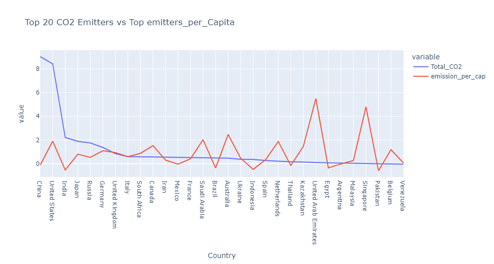

# Data Science Portfolio

## About Me

My name is Israel Ezema, I am a Data Scientist, graduate of the Explore’s Data Science Accelerator [Oct 2021] program, and completed my first degree in Civil Engineering at Nnamdi Azikiwe University Awka. More information about my academic journey can be found in [My Website](https://sites.google.com/view/e-israel/home), [My Linkedin](https://www.linkedin.com/in/israel-ezema-009530195/), [My Resume](https://drive.google.com/file/d/1BLaZAj37Xn0cVAKfArk0Q1p6G0MaVcbC/view?usp=sharing), and [My Kaggle](https://www.kaggle.com/israelezema)

## Projects

This is a list of some machine learning projects I worked on or currently working on. It is updated regularly. Click on the projects to see full analysis and code.

**Other Future Interest:**  Medical Diagnosis,  Predictive Maintenance,  Financial Analysis etc.

---

### 1. [FUTURE PROJECT: Asset Management (PRIVATE)]()

With the evolution of times, policies, processes, culture, and trends, companies, and organizations are faced with the challenge of effectively managing, organizing, and maximizing VALUE from investments, acquired assets or holdings, all within acceptable risk and regulatory requirement. This is an enormous challenge as it cuts across all strata of business involvement. When properly deployed, asset management helps stakeholders, decision-makers, and employees predict and oversee the life cycle of an asset. For instance;
*	Live overseeing of assets
*	Making critical decisions
*	Appropriate maintenance schedules
*	Gathering and overseeing the data generated by the assets
*	Inventory management, etc.

There are varying forms of assets that can be managed which includes;
1.	**Digital asset management;** for efficient organization of digital media and content
2.	**Enterprise assets management;** Involves documentation, productivity, inventory, and conditioning of company-owned facilities or physical assets through their entire lifecycle
3.	**Financial asset management;** encompasses investments, real estate holdings, brokerage services, and all the intangible investments of an organization to maximize profit over time while mitigating risk.
4.	**Fixed asset management;** refers to property, plant, and equipment or PP&E
5.	**Infrastructure asset Management;** involves maintaining, updating, and potentially removing these vital utilities such as roads, water access, electricity, and civil engineering.
6.	**IT asset management;** both tangible & intangible company-owned assets and devices

I aim at commencing from Infrastructure Asset Management, studying already existing systems, utilizing my experience as a Data Scientist, Civil Engineer, and Inventory Specialist to review and recommend better systems, proffering solutions to identified gaps, build and apply predictive models available for automation of processes, improving decision making, and improving the overall operation of the facility.
In this project, I intend using public data provided in Nigeria or other public datasets. `This is due to sufficient data availability. I welcome provision of any supportive data that could aid me accomplish my goal. ezema.israel@gmail.com`

**Project work-flow;**
1.	Data Sourcing / Web scraping
2.	Data cleaning and data processing
3.	Exploratory data analysis
4.	Feature Engineering
5.	Model Building and Model Selection
6.	Model Deployment

**Keywords:** Web scraping, data processing, Exploratory Data Analysis (EDA), Feature Engineering, Predictive learning

---

### 2. [EDSA/AiGlass: Carbon Emission Analysis & Prediction (PUBLIC)](https://github.com/EDSA-Internship-Group-3/co2-emission-analysis)

As the world becomes even more modernized by the year, it's becoming all the more POLLUTED. UN Official Data States:
1. Over 3 BILLION PEOPLE of the world’s 8 Billion people are affected by degrading ecosystems 
2. Pollution is responsible for some 9 MILLION premature deaths each year
3. Over 1 million plant and animal species risk extinction

With CO2 being a significant air pollutant, It's important to studying how to reduce CO2 emission without curbing economic growth. Hence the need to continue in this research which was built upon an initial analysis on [Kaggle](https://www.kaggle.com/code/lobosi/part-7-co2-emission-analysis). The data source originated from the US Energy Administration and joined together for an easier analysis. Its a collection of some big factors that play into C02 Emissions, with everything from the Production and Consumption of each type of major energy source for each country and its pollution rating each year. It also includes each countries GDP, Population, Energy intensity per capita (person), and Energy intensity per GDP (per person GDP). All the data spans all the way from the 1980's to 2020. 

We further Normalized and enriched the dataset with extra features from the [World Bank Data Website](https://data.worldbank.org/);
1. Rate of population change - To see if a possible change in population of a place will result in change in CO2 emission & to What extent
2. Population density - Does the density of a population have any effect on CO2 Emission?
3. GDP splits - Example, % for agriculture vs manufacturing; Hypothetically, GDP increase due to agricultural/Green activities should oppose the direct correlation of rise in GDP to CO2 Emission
4. Rate of Deforestation - As a result of our research on why the Dip in CO2 Emission of the World occurred in 2009 and the sudden rise in 2010 when Energy Type, Pop, and GDP were Constant.

`Our Best Performing Model was XGBoost with an RMSE of 15.227 MMtonnes CO2 with Energy Consumption, Energy Type & Emission per capita features as the major determinant features.`

What I learned from this project:
* It's entirely wrong to state that the larger the population, the more CO2 the country will be likely to emit. It's more dependent on the Activity, Culture, and policies of a place to reduce the CO2 Emitted per head/capita index.
* The larger the Energy Consumption of a country, the larger the CO2 emission, which is dependent on the prevalent Energy type being consumed in that region.
* The larger the GDP, the more likely the country will have a high CO2 emission, This Is NOT entirely true as the GDP of a place has many contributing factors and the essentials that correlate to CO2 Emission are the Manufacturing and Agricultural activities of the Place.
Coal and Petroleum/other liquids have been the dominant energy source contributing to CO2 Emitted globally.

**Keywords:** CO2_Emission_per_Capita, Energy Consumption, Population, GDP, XGBoost, RMSE.

---

### 3. [EDSA/AI Incorporated: Streamlit-based: Movie Recommender System (PUBLIC)](https://github.com/2110ACDS-T4/unsupervised-predict-streamlit-template/blob/master/Team%204/Notebooks/3.0_EDSA_movie_recommendation_2022_Notebook.ipynb)

This project was part of the requirement to complete the Unsupervised Predict within EDSA's Data Science course. It required us to build and deploy a basic recommender engine based upon the Streamlit web application framework. In the end, I completed the following;

* Constructed several recommendation algorithm based on Content and Collaborative filtering
* Applied Model Versioning with COMET
* Carried out Several Data Processing, Exploratory Data Analysis, and Feature Engineering techniques
* Applied the 'Did you mean?' Algorithm (Levenshtein Distance)
* Deploying our best Model to a Streamlit Web App.

**Keywords:** Recommendation algorithm, Streamlit web deployment, COMET versioning, Exploratory Data Analysis (EDA)

---

### 4. [EDSA/DataWare Solutions - Climate Change Belief Analysis 2022 (PUBLIC)](https://github.com/2110ACDS-T12/classification-predict-streamlit-template/blob/master/Project%20File/5.0%20Advance_Classification_Notebook.ipynb)

This project was part of the requirement to complete the Classification Predict within EDSA's Data Science course. Companies are constantly in the push for more sustainable business practices, products and services with many increasingly labeling themselves “eco-friendly”, but along with that, like every other business, feasibility is very important, as well as maximising productivity and profitability. Hence the development through the knowledge of the demand & Supply on her goods & services, being able to classify Tweets, messages and comments of her market to sentiment classes. During the course of the project carried out;

* Data preprocessing
* Natural Language Processing (NLP) 
* Performed data wrangling and exploratory data analysis with Matplotlib and Seaborn
* Applied Data processing techniques such as Text Cleaning, Tokenization, Stemming & Lemming 
* Applied both Oversampling and Undersapmling Class Balancing Techniques
* Applied several classifier models and Evaluated for the Best Prforming Fi-Score
* Hypertuned Best Model
* Deployed on Streamlit Web Based App

**Keywords:** Natural Language Processing (NLP), Class Balancing, Hypertunning, Tokenization

---

### 5. [EDSA Classification Hackathon: South African language Identification (PUBLIC)](https://github.com/Ezysticks/south_african_language_identification)

South Africa is a multicultural society that is characterised by its rich linguistic diversity. Language is an indispensable tool that can be used to deepen democracy and also contribute to the social, cultural, intellectual, economic and political life of the South African society. With such a multilingual population, it is only obvious that the South African systems and devices should also be able to communicate in multi-languages.

Hence, I created a Machine Learning Model which takes text which is in any of South Africa's 11 Official languages and identify which language the text is in. The goal of the model is to determining the natural language that a piece of text is written in.

In this project, I:
* Applied NLP techniques
* Multinomial Naive Bayes classifier as best performing 
* Evaluated Model Performance Using Confusion Matrix
* Extracted and Submitted Test Prediction file to Kaggle

**Keywords:** NLP, EDA, Naive Bayes classifier, Confusion Matrix

---

### 6. [EDSA: Spain Electricity Shortfall Challenge (PUBLIC)](https://github.com/Ezysticks/load-shortfall-regression-predict-api/blob/master/Advanced-Regression-Starter-Data/Versions_Team_9_EDSA/3.1%20starter-notebook-checkpoint_.ipynb)

This project was part of the requirement to complete the Advanced Regression Predict within EDSA's Data Science course. The government of Spain was considering an expansion of it's renewable energy resource infrastructure investments. As such, they require information on the trends and patterns of the countries renewable sources and fossil fuel energy generation.I was tasked to:

1. analyse the supplied data;
2. identify potential errors in the data and clean the existing data set;
3. determine if additional features can be added to enrich the data set;
4. build a model that is capable of forecasting the three hourly demand shortfalls;
5. evaluate the accuracy of the best machine learning model;
6. determine what features were most important in the model’s prediction decision, and
7. explain the inner working of the model to a non-technical audience.

It was a Time Series project of which I went through the entire data science lifecycle, including:

* Data wrangling / Data Preprocessing / Handling missing values
* Exploratory Data Analysis / Data Visualization
* Feature Extraction & Engineering
* Modelling and Hypertunning Best Model

**Keywords:** Data Wrangling, EDA, Feature Engineering, Handling missing values, Modelling, Hypertunning

---
